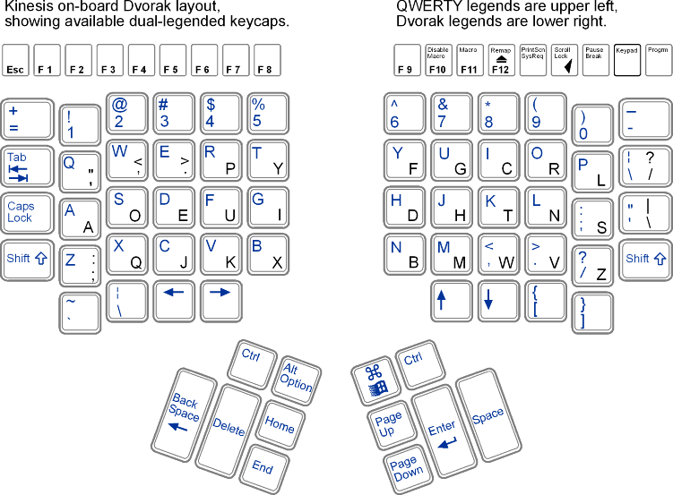

## Customization

Advantage doesn't support configuration files, take the following steps to reproduce the setup on the original layout shown below.
- Reset the keyboard : Program + Shift + F10
- Switch to Dvorak : Program + Shift + F5
- Switch to Windows configuration : =w
- Turn off sound : Program + Hypen
- Turn off click : Program + /
- Reprogram keys : Program + F12
  - Swap Up and Down (so it's similar to j & k)
  - Swap Tab & Delete
  - Copy Home to End
  - Copy End to Page Down
  - Copy Cmd to Thumb Down ( Original Home & Page Up)
  - Copy Ctrl to Thumb Outside ( Original Ctrl )
  - Copy Alt to Thumb Inside ( Original Alt & Winkey )

